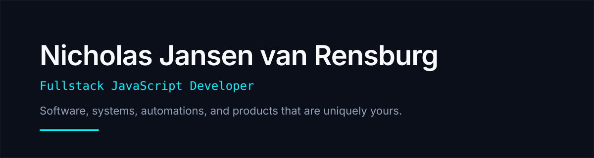
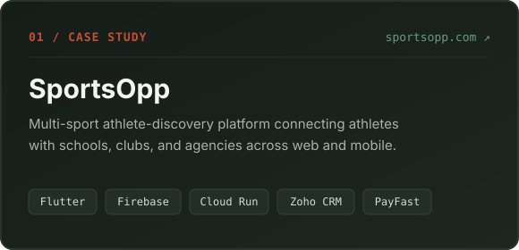
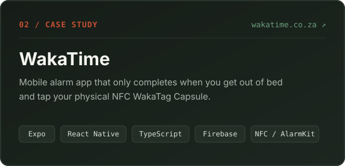

  

   

  

    
    &nbsp;
    
    &nbsp;
    
  

---

### About Me

I'm a developer based in **South Africa** building full-stack web apps, native mobile experiences, and business automations. Whether it's a multi-sport discovery platform with cloud video pipelines or an alarm clock that only stops when you walk across the room and tap a physical NFC capsule, I care about clear trust boundaries, tactile details, and shipping things people actually use.

---

### Selected Work · `2026 — Now`

  
  

  
<strong>01 · SportsOpp</strong> — Recent Milestones &amp; Case Study Highlights

   

  > **Live Product:** [sportsopp.com](https://sportsopp.com/) · **Full Case Study:** [nicholas.cinhaus.co.za/projects/sportsopp](https://nicholas.cinhaus.co.za/projects/sportsopp/)

  - **`2026-08-06` · RELIABILITY** — Repaired authenticated-user bootstrap edge cases and improved callable error clarity.
  - **`2026-07-27` · PLATFORM** — Shipped guest profile previews, curated Explore feeds, and stricter Firestore owner-write rules.
  - **`2026-07-12` · OPERATIONS** — Connected Firebase signups to Zoho CRM with role-based dashboards for athletes and organisations.
  - **`2026-06-07` · ENGINEERING** — Built a Cloud Run + FFmpeg pipeline for native athlete highlight-video processing.

  
<strong>02 · WakaTime</strong> — Recent Milestones &amp; Case Study Highlights

   

  > **Live Product:** [wakatime.co.za](https://wakatime.co.za/) · **Full Case Study:** [nicholas.cinhaus.co.za/projects/wakatime](https://nicholas.cinhaus.co.za/projects/wakatime/)

  - **`2026-09-20` · POLISH** — Aligned alarm labels with the home clock and simplified sound & notification settings.
  - **`2026-09-19` · EXPERIENCE** — Added branded onboarding, clearer NFC guidance, and loop-safe alarm audio.
  - **`2026-09-12` · PRODUCT** — Shipped the core ownership rule: one account, one phone, one physical WakaTag Capsule.
  - **`2026-08-16` · RELIABILITY** — Integrated iOS AlarmKit with branded wake-up audio and seamless app handoff.

---

### What I Build With

| Layer | Technologies |
| :--- | :--- |
| **Mobile & Web** |      |
| **Backend & Cloud** |      |
| **Hardware & Ops** |     |

---

### How I Work

- **`01 · CRAFT` — End-to-end ownership:** From data models, server-side security rules, and Cloud Run pipelines to the final mobile gesture and onboarding flow.
- **`02 · REALITY` — Shaped around real habits:** Software works best when it respects how people actually behave—early in the morning, on the field, or inside a busy operations team.
- **`03 · RECORD` — Documented as it happens:** Every project keeps a dated changelog of architecture shifts, security hardening, and product lessons rather than a static pitch.
